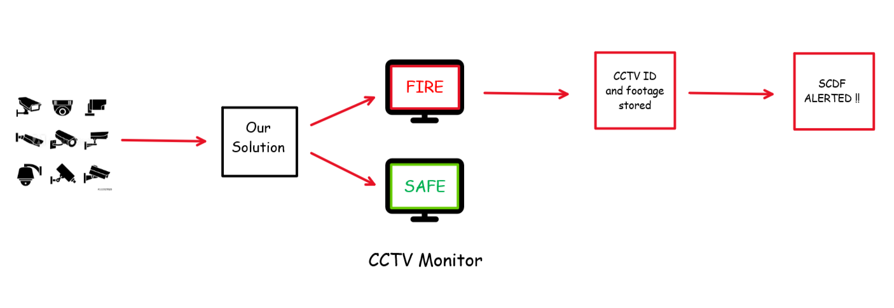

# CCTV Hazard Detection

## About

This solution aims to use Computer Vision, IoT and Artificial Intelligence to create a robust system for identifying the seat/source of fire using live CCTV footage.

## Implementation

The model is deployed between the CCTV-Monitor communication line as shown in the figure. When the model detects fire from CCTV [Unique ID: 1A] the following series of events would be activated immediately:

* CCTV 1A highlighted on monitor.
* CCTV 1A's Unique ID and footage stored.
* Fire alarm triggered.
* SCDF alerted with the location of premise as well as the location of CCTV 1A within the premise.

On SCDF's arrival:

* Ground Commander could link up with the FSM to gain access to the CCTV footage in order to determine what is on fire.
* Ground Commander could use the floor plan as a reference to further clarify the location of CCTV.

## How this technology could help SCDF operations

1. Early identification of fire seat/source resulting in faster mitigation.
2. Access to information regarding the nature of fire prior to entering the risk zone.
3. Better understading of potential hazards involved such as backdraft, flashover etc.
4. An Earlier intervention may prevent further precious resources from being activated.

## Current Technologies

We believe the current Fire Alarm System to be a robust architecture which is very effective for identifying the presence of fire in a premise. Thus, our vision is not to replace this phenomenal system but to integrate with it. We see our final solution to be working hand-in-hand with the current FAS to create a system capable of locating the seat/source of fire as effectively as detecting its presence in a premise.  

## Limitations and Prove of Concept

### Limitations:

* Lack of good quality data-set with more than 10,000 data points depicting real-life fire incidents.
* Shortage of time to train for large number of steps/epochs.
* Access to CCTV system as it may be confidential.

Taking these points into consideration we were not able to develop a Minimum Viable Product but were successful in developing a Proof of Concept.

### Proof of Concept

We downloaded unlabeled fire images and videos from the internet. Then, we labeled those images manually using IBM's cloud annotation service. Once we had a dataset with 500 labeled points we trained our model using IBM's machine learning service for 500 steps.After training, we downloaded the model and integrated it with the react framework. 

**End Product**

Once installed and setup users can launch the web application in their browsers to detect fire in realtime using webcam.

## Future

Some improvements that could be implemented in the future:

1. With no doubt the first step is to create a Minimum Viable Product with CCTV footage to better understand CCTV format.
2. Expansion of the solution to different hazard domains such as building collapse, people collapsing, RTA, distress detection etc.
3. A method to provide CCTV footage first-hand to the responders thus eliminating the need to link up with the FSM.

## Conclusion 

The proposed concept would immensely help fire responders in handling of fire operations. The solution stands strong from a financial view point as there is no requirement for the deployment and/or manufacture of new hardware since the solution makes use of CCTV technology which is already installed in a vast majority of buildings in Singapore. The proposed idea is not limited to fire hazards but could be easily implemented for other hazard domains as well.
