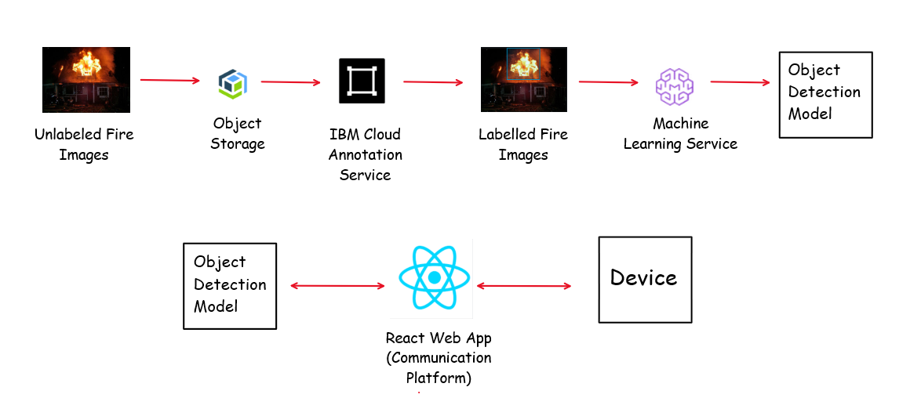

# CtrlAltElite-CCTVHazardDetection_SCDFXIBM

## Contents

1. [Short description](#short-description)
1. [Pitch video](#pitch-video)
1. [The architecture](#the-architecture)
1. [Detailed Solution](#detailed-solution)
1. [Getting started](#getting-started)
1. [Built with](#built-with)

## Short description

### What's the problem?

Fire Alarm systems make use of temperature change and smoke detectors to identify fire hazards. This technology, though effective to determine the presence of fire in a premise, fails to locate the seat/source of fire.

### How can technology help?

Computer vision along with Artificial Intelligence make use of visual indicators to identify fire hazards as opposed to temperature change. Thus, this technology could be deployed to detemine the precise location of the seat/source of fire in a premise.

### The idea

The proposed idea is to develop an Artificial Intelligence model to detect fire on live CCTV footage. This model is designed to work hand-in-hand with the current fire hazard control technologies to achieve an enhanced emergency response.

## Pitch video

[Pitch Video](https://www.google.com)

## The architecture

## Detailed Solution

[Detailed Solution](Description.md)

## Getting Started

### Setup

`git clone` the repo `cd` into object-detection-react by running the following command:

`git clone https://github.com/shoibloya/CtrlAltElite-CCTVHazardDetection_SCDFXIBM.git`

`cd CtrlAltElite-CCTVHazardDetection_SCDFXIBM/object-detection-react`

### Installation

Inside object-detection-react execute:

`npm install`

### Running

After installation execute the following command:

`npm start`

Then open http://localhost:3000 to view it in the browser.

## Built with

### Services

* Object Storage
* Cloud Annotation
* Machine Learning

### Repositories

* https://github.com/cloud-annotations/object-detection-react
